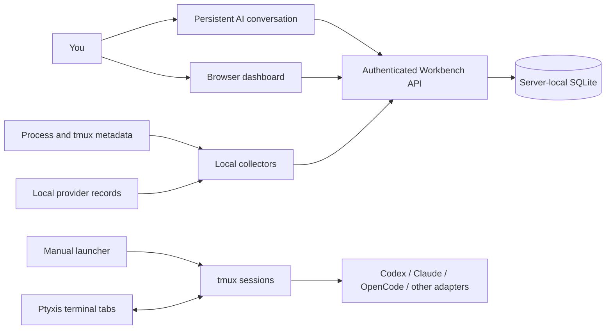

# Starforge Workbench

For everyday use, open **Everyday guide & startup** from the dashboard navigation (`/guide`). It covers launching sessions, daily conversations, task updates, reports, and health checks.


A personal workbench for keeping human commitments, AI activity, and daily attention in one place.

I built this around my own tools and working habits, with AI doing much of the implementation. I'm sharing it as a working reference and a launch point for your own system. Expect to adapt it: this is an evolving personal project, not a polished application with a universal installer or a stable compatibility promise.

At a glance, Workbench combines a tmux-based launcher for persistent AI sessions, an authenticated API for shared work state, local collectors that observe provider activity, and a browser dashboard that groups current work and items needing attention. It helps a person track and review work; observations never authorize an agent to act or prove that a task is complete.

**The best way to understand the current feature set is to have your AI inspect the code and tests. This README is an orientation and is not necessarily kept current.** Ask your AI to distinguish implemented behavior from examples, assumptions, and unfinished work. Source inspection is the starting point; running the relevant tests and checking your environment still matter.

## Start with your AI

Give your AI this repository and a request like:

> Inspect Starforge Workbench's source and tests. Explain what it currently does, identify assumptions that do not fit my machine or workflow, and compare existing alternatives. Help me build the smallest useful version for me. Start with the launcher, API, and collectors; use synthetic data while adapting it. Keep my credentials and personal configuration outside Git.

You are welcome to borrow individual pieces, fork it, or replace parts with better existing tools. Reducing maintenance and improving daily usefulness matter more to me than growing this into a competing platform.

## How the pieces fit



The conversation is the everyday control surface: ask what needs attention, record a task, or review accomplishments in natural language. The browser reads the same state through the same service. The launcher manages agent sessions separately; a dashboard observation does not itself execute work.

### tmux and Ptyxis

- **tmux** owns the terminal sessions so a terminal window can close without necessarily ending the underlying agent. The launcher uses a dedicated tmux server, named contexts, protected session bindings, and checkout locks to avoid duplicate sessions and conflicting workspace ownership.
- **Ptyxis** supplies the graphical terminal windows and tabs on the Linux/GNOME setup this grew from. A small Python/GObject/D-Bus bridge targets the owned terminal process and maintains a separate terminal configuration. This desktop integration is specific to that environment.
- Commands include `doctor`, `list`, `plan`, `up`, `attach`, and `status`. A dry-run previews launch plans. Headless operation can use tmux without opening Ptyxis.
- Codex and OpenCode support remembering and resuming an exact conversation, with checks against local provider records. Claude has its own resume handling. Provider processes, session bindings, and window presence are checked separately; an open tab alone is not proof that an agent started successfully.
- Startup has bounded retries for early failures. The code also contains Antigravity and Ollama adapters. Provider commands, paths, local record schemas, and terminal behavior are compatibility points to inspect before using them on your machine.

See [`src/starforge_workbench/`](src/starforge_workbench/) and the [example manifest](config/workbench.example.yaml).
Provider compatibility claims and their evidence level are tracked in the
[capability matrix](docs/provider-capabilities.md). Recheck that matrix and use
its opt-in smoke procedure after provider upgrades; fixture coverage is not a
claim that a real provider version was exercised end to end.

For wheel scrolling, selection, and link behavior, ask AIW to inspect and adapt
your terminal settings; see [mouse scrolling and terminal preferences](docs/adapting.md#mouse-scrolling-and-terminal-preferences).

### Shared work state and attention

The Python/FastAPI service stores objectives, actions, events, runs, artifacts, and collector health in server-local SQLite. Jinja templates and HTMX provide the browser view. The JSON API lets an AI operate the same records through the `wb-api` client.

The attention and dashboard views bring together work that needs you, active runs, next actions, and recent observations. Reports cover accomplishments, planned work, and standup windows. Reporting conventions still reflect a personal workflow and may need adaptation.

Some important distinctions guide the implementation:

- An observation or suggestion is different from an accepted commitment.
- An agent reporting an accomplishment is different from independently verified completion.
- Process presence, recent activity, and task progress are different signals.
- An offline collector means visibility is missing; it does not establish that a task failed.
- Alerts and stored approval fields do not grant permission to execute work.

See [`src/workbench/main.py`](src/workbench/main.py), [the models](src/workbench/models.py), [attention derivation](src/workbench/attention.py), and [repository/state transitions](src/workbench/repository.py).
Exact-ID operator association of an existing process generation is documented in
[action-to-run linking](docs/action-run-linking.md).
[RECENT activity](docs/recent-activity.md) shows readable subject titles and relative times, with original audit details on expansion.

### Optional attention notifications

The separate `wb-notify` worker can send Pushover summaries of new or meaningfully
changed attention items. It is disabled by default, keeps credentials and delivery
state outside Git, suppresses unchanged alerts across restarts, and uses generic
text unless title inclusion is explicitly enabled. Delivery never changes task
commitments or runs. See [notification setup and policy](docs/notifications.md) for
preview, explicit test delivery, retries, privacy and operational limits.

### Codex, Claude, and OpenCode collectors

Collectors run locally and submit observations to the central API with a separate credential role. Their health is tracked independently. Cursors or acknowledged identities support restart recovery and duplicate suppression.

| Collector | Reads locally | Sends to Workbench |
| --- | --- | --- |
| Launcher/process collector | tmux metadata and Linux process metadata | Provider presence, process lifetime, and available activity timestamps. It does not read terminal contents. |
| Codex observer | Local session JSONL records | Brief, attributed accomplishment summaries selected by a completion-word heuristic. **These summaries contain derived response text**; raw transcripts remain local. Sensitive-pattern filtering is limited and is not a general data-loss-prevention system. |
| Claude observer | Local Claude assistant records | Allowlisted activity types, timestamps, and record/session identity. Prompt, response, reasoning, and tool payload text remain local. |
| OpenCode observer | OpenCode's local SQLite message records, opened read-only; optionally a private minimized plugin-event queue | Allowlisted metadata for completed assistant messages and, when explicitly configured, generation-checked permission, question, or provider-error incidents. Message text, questions, errors, reasoning, tool payloads, and authentication data remain local. OpenCode is treated as a distinct application regardless of its model provider. |

Collectors have provider-specific setup requirements and depend on local formats that can change. See the [adaptation notes](docs/adapting.md), [collector and observer modules](src/workbench/), and their tests for details.

The optional [Google Keep collector](docs/google-keep-collector.md) reads one configured checklist through an existing browser connection.

## Trying or adapting it

The service uses Python 3.12+ and `uv`. The launcher additionally assumes Linux, tmux, zsh, installed/authenticated provider applications, and—when using graphical tabs—Ptyxis and system Python GObject bindings.

```sh
uv sync --frozen
uv run pytest -q
bin/ai-workbench --dry-run up
```

The example manifest contains illustrative directories. Copy it to the Git-ignored `config/workbench.yaml`, adjust paths and enabled contexts, and inspect provider executable discovery before launching anything. Start one context at a time. The launcher falls back to the example when no personal manifest exists.

See [local API setup and adaptation notes](docs/adapting.md) for credential creation, running the service, and deployment assumptions.

`deploy/` contains deployment helpers and systemd units from the working system. They install services and may enable collection when run. Treat them as recipes to inspect and adapt, not as commands the quickstart executes. No deployment or provider launch occurs merely from installing the Python package.

## Other projects worth exploring

These projects were discovered while researching alternatives before publishing Starforge Workbench. They were **not the inspiration for its original implementation**. They solve overlapping problems in different ways and may be a better starting point for you—or a source of components and ideas we should adopt here.

| Project | Direction worth exploring |
| --- | --- |
| [LifeOS / Personal AI Infrastructure (PAI)](https://github.com/danielmiessler/LifeOS) | Personal context, goals, memory, and skills around an AI assistant. |
| [Paperclip](https://github.com/paperclipai/paperclip) | Coordinating agent work with tasks, goals, governance, and budgets. |
| [Agent Deck](https://github.com/asheshgoplani/agent-deck) | Managing multiple agent terminal sessions on top of tmux. |
| [Beads](https://github.com/gastownhall/beads) | Durable, dependency-aware task memory for agents. |
| [Hermes Agent](https://github.com/NousResearch/hermes-agent) | A personal assistant with memory and skills that develop through use. |
| [OpenClaw](https://github.com/openclaw/openclaw) | A personal assistant gateway across messaging channels and agent integrations. |

This is a short reading list, not an exhaustive comparison or an endorsement of every project's design. Check their current code and documentation too.

## Feedback and contributions

Email me, Randall Embry, at [rpembry@gmail.com](mailto:rpembry@gmail.com), or use [GitHub Issues](https://github.com/rpembry/starforge-workbench/issues), [Discussions](https://github.com/rpembry/starforge-workbench/discussions), and pull requests.

Bug reports, suggestions, experiences adapting the system, and recommendations to use existing tools are welcome. Please describe what you expected, what happened, and the relevant version or commit. Synthetic examples are especially helpful. Small, focused changes are easier to review; see [CONTRIBUTING.md](CONTRIBUTING.md).

For suspected vulnerabilities or accidental disclosures, use the private reporting options in [SECURITY.md](SECURITY.md). Please do not put credentials or private transcripts in public issues.

## License

[MIT](LICENSE), copyright 2026 Randall Embry. You may adapt and redistribute it, including commercially, under the license terms. Contributions back are appreciated, not required. Vendored HTMX retains its [Zero-Clause BSD license](src/workbench/static/htmx-LICENSE.txt).

## Engineering workflow

See [human-directed agent coordination](docs/multi-agent-coordination.md) for how this project uses GitHub, Workbench, and assigned AI agents to develop and review changes.
